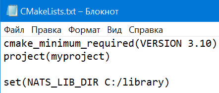
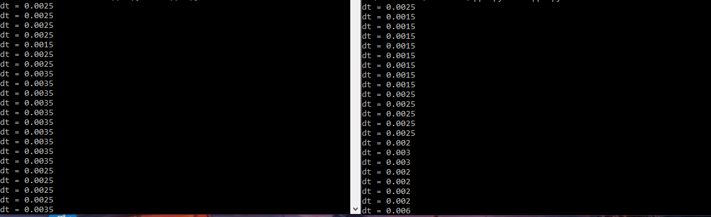

# Решение к заданию
## Задание:

Реализовать 2 приложения, которые обмениваются синхросигналами через шину данных 
(брокер сообщений NATS streaming STAN или RabbitMQ):
- приложение 1 записывает тик времени в основном потоке раз в 10 мс и асинхронно 
передает в шину данных
- приложение 2 считывает из шины данных и выводит в консоль dt, 
где "dt=t_real- t_sign", где t_real - UNIXTIME время приема 
сообщения в сек.мс (округление до мс), t_sign - время в теле сообщения
- приложение 2 аналогично асинхронно отправляет свой тик времени 
в приложение 1, которое в свою очередь выводит в консоль dt.

# При разработке использовались:

- Язык `C++`
- Брокер сообщений `NATS`
- Docker

# Установка

Установка стороннего ПО для проекта: 

 - [**Cmake**](https://cmake.org/download/)
 - [**OPENSSL**](https://github.com/openssl/openssl/tree/master)
 - Библиотеки [**nats.c**](https://github.com/nats-io/nats.c?tab=readme-ov-file#installing)

Качаем репозиторий

```bash
git clone https://github.com/Katabym/C_ServerTask.git
```

В папке Client_1 и Client_2 в файле `CMakeLists.txt` требуется изменить путь до установленной библиотеки
`nats.c`

По умолчанию прописан `C:/library`

|  |
|---------------------------------|

# Запуск

Переходим в директорию проекта.

Запускаем файл docker-compose

```shell
docker-compose up
```

# Результаты

Собранный проект будет выводить логи в консоли контейнеров Client_1 и Client_2.

Чтобы вывести их в локальную консоль можно использовать

```shell
docker logs -f <CONTAINER ID>
```

Для того чтобы узнать `CONTAINER ID` можно применить команду

```shell
docker ps
```

|  |
|-----------------------|

При запуске одного приложения(любого из двух) консоль будет пуста. Записанный приложением тик времени начнет передаваться в шину данных каждые 10 мс.

При запуске второго приложения в обоих консолях каждые 10 мс будут выводиться результаты найденного dt.

При остановке одного из приложений консоль второго приложения перестанет выводить новые результаты. Но записанный работающим приложением тик времени продолжит передаваться в шину данных каждые 10 мс.

При повторном запуске остановленного приложения в обоих консолях снова начнут выводиться результаты dt.
